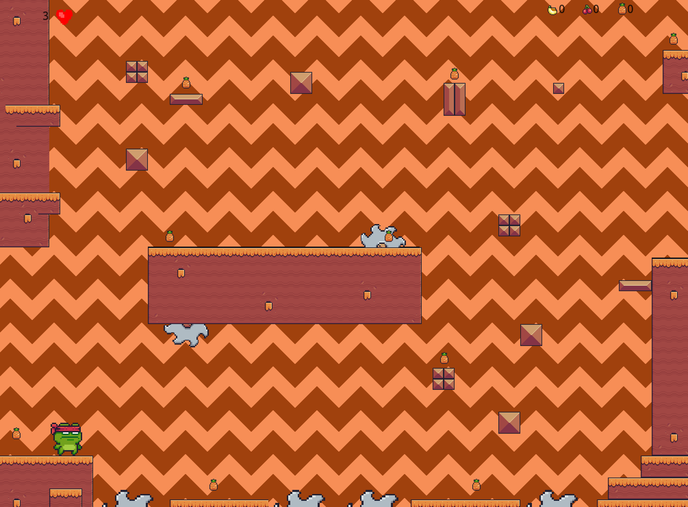
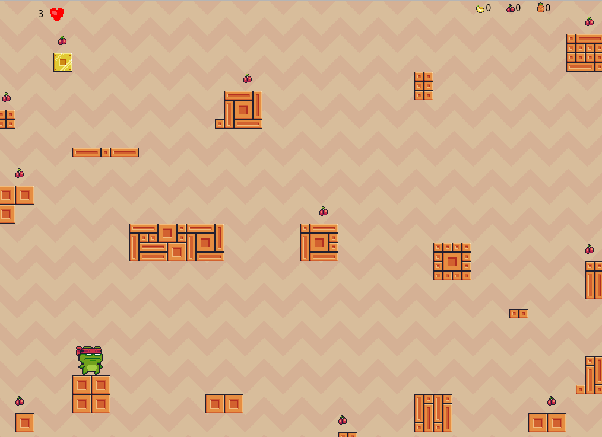

<!-- PROJECT LOGO -->
 

  

  <h2 align="center">Frog Platformer</h2>

  

   <h3> A simple platformer with a complete gameplay loop    </h3> 
     
 
    
  

<!-- ABOUT THE PROJECT -->
## About The Project

I made created this project back in 2019 for a class assignment that required me to build a game with GameMaker Studio 2. The game had to have a menu screen, multiple levels, sound effects, how-to-play screen, and a complete gameplay loop (a loop that keeps the player in the game no matter what action).

The objective of the game is really simple.

Here's why:
* The player must collect all the fruit found in the level.   
* Avoid all the obstacles         
* Don’t Die :smile:

Follow these steps and you should be able to beat the game no problem!

## Project Preview

<h2>Other Levels</h2>

 

   

 

## Built With:

<a href = "https://www.yoyogames.com/en/gamemaker" > GameMaker Studio 2 </a>

## Assets 

All art assets were obtained from <a href = "https://pixelfrog-assets.itch.io/pixel-adventure-1"  > here </a>

## Language: 

GameMaker Language is GameMaker's scripting language. It is an imperative, dynamically typed language commonly likened to JavaScript and C-like languages. The language's default mode of operation on native platforms is via a stack machine; it can also be source-to-source compiled to C++ via LLVM for higher performance.

## Download

In order to play the game you will need to download GameMaker Studio 2, you can do that <a href = "https://www.yoyogames.com/en/get" > here. </a> Once downloaded you can open the game files in GMS2. 
